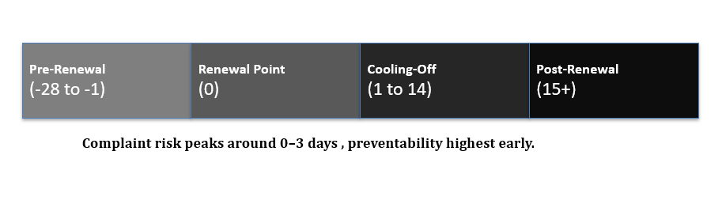

# Auto-Renewal & Policy Lifecycle Analytics

## Overview

This project analyses customer behaviour, awareness, and complaint patterns across the policy auto-renewal lifecycle within regulated insurance environments.

The objective is to identify where customer dissatisfaction arises despite compliant processes, and to distinguish between preventable and non-preventable complaints driven by timing, communication, and expectation gaps.

The analysis focuses on the end-to-end policy lifecycle, including pre-renewal communication, automated payment timing, cooling-off periods, and agent intervention points.

---

## Business Problem

Auto-renewal processes are designed to protect customer cover continuity, yet they frequently generate complaints related to:

- Customers being unaware of policy renewal
- Surprise financial transactions
- Perceived lack of consent
- Late-stage dissatisfaction during the cooling-off period

This project explores why these issues occur and how analytics can support better decision-making, communication strategies, and complaint prevention.

---

## Key Questions Explored

- At which stages of the policy lifecycle do complaints most commonly arise?
- How does customer awareness vary before and after renewal?
- Which complaint drivers are preventable through communication or timing changes?
- Where can earlier intervention reduce escalation risk?
- How can insights support fair, compliant, and customer-centred decisions?

---

## Scope of Analysis

The project focuses on:
- Policy lifecycle stages (pre-renewal, renewal, cooling-off, post-renewal)
- Customer awareness and understanding
- Timing of communication and payments
- Complaint escalation patterns
- Preventability indicators

All data used is synthetic and anonymised for demonstration purposes.

---

## Repository Structure

- `framework/` — lifecycle model and analytical dimensions  
- `data/` — synthetic dataset used for demonstration  
- `analysis/` — timeline-driven insights summary  

---

## Key Outputs

- Policy lifecycle segmentation model
- Defined complaint and awareness dimensions
- Timeline-based insights on complaint clustering and preventability
- Decision implications for communication, timing, and escalation handling

---

## Tools & Approach

- Excel and structured analysis
- SQL-style aggregation logic
- Python (optional) for timeline analysis
- Decision-focused insight reporting

---

  

---

## Author

Rajath Gowda  
Data & Insight Analyst  
Customer Intelligence & Decision Analytics
